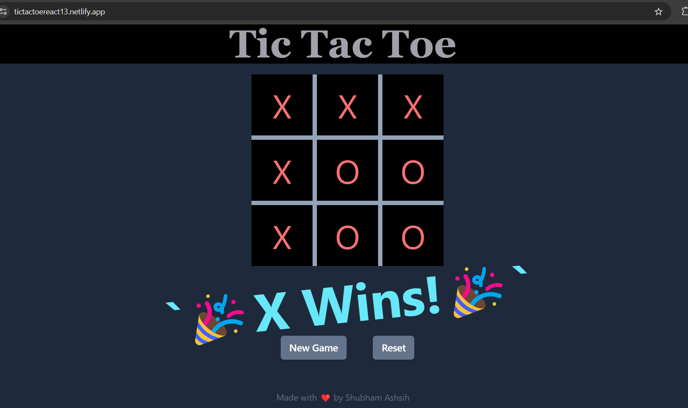

# Tic Tac Toe using React 🎮

This repository contains an implementation of the classic game Tic Tac Toe using React. It was built using Vite, a lightning-fast build tool that aims to provide an efficient development experience.

The project utilizes the `@vitejs/plugin-react` plugin for React support, which enables Fast Refresh, allowing for seamless updates to the UI without a full page reload. Additionally, ESLint rules are included to maintain code quality.

To get started, you can clone this repository and run `npm install` to install the dependencies. After that, you can run `npm run dev` to start the development server.

The game can be played at [https://tictactoereact13.netlify.app/](https://tictactoereact13.netlify.app/). In this project, I have implemented the game logic, including the game board, player turns, and win/draw conditions.

Feel free to use this project as a starting point for your own Tic Tac Toe implementations.

